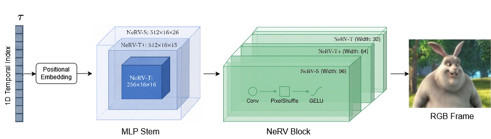

# TinyNeRV: Compact Neural Video Representations via Capacity Scaling, Distillation, and Low-Precision Inference

Official implementation accompanying the paper:

**TinyNeRV: Compact Neural Video Representations via Capacity Scaling, Distillation, and Low-Precision Inference**

This repository provides code for training and evaluating compact **Neural Representations for Videos (NeRV)** designed for deployment under strict computational and memory constraints.

The work investigates the tiny-capacity regime of NeRV models, introducing two lightweight configurations:

- **NeRV-T** – extreme throughput-oriented model optimized for maximum decoding speed and minimal computational cost  
- **NeRV-T+** – slightly larger configuration that improves reconstruction quality while preserving high efficiency  

The repository includes scripts for:

- Baseline NeRV training  
- Knowledge distillation (KD)
- Post-training quantization (PTQ)  
- Quantization-aware training (QAT)
- Joint KD + QAT training

The implementation builds on the original NeRV framework:

NeRV: Neural Representations for Videos (NeurIPS 2021)  
https://arxiv.org/abs/2110.13903

---

## Method Overview

<p align="center">
  
</p>

TinyNeRV explores the low-capacity regime of Neural Video Representations (NeRV) by systematically scaling the architecture width and MLP dimensions.  

The proposed **NeRV-T** and **NeRV-T+** configurations significantly reduce model capacity compared to NeRV-S while preserving high reconstruction quality and real-time decoding performance. The architecture follows the original NeRV pipeline consisting of a temporal positional embedding, an MLP stem, and a stack of NeRV blocks that progressively upsample features to generate the final RGB frame.

---

# Repository Structure

```
.
├── train_nerv.py                 # Baseline training and evaluation
├── train_nerv_kd_feature.py      # Feature-based knowledge distillation
├── train_nerv_kd_final.py        # Final-output distillation
├── train_nerv_kd_temporal.py     # Temporal consistency distillation
├── train_nerv_kd_freqfocal.py    # Frequency–focal distillation
├── train_nerv_qat_int4.py        # Quantization-aware training (INT4)
├── train_nerv_kd_qat_int4.py     # Knowledge distillation + QAT
├── model_nerv.py                 # NeRV architecture
├── utils.py                      # Utility functions
├── edge_metrics.py               # Edge-performance analysis
├── flicker_measure_tPSNR.py      # Temporal flicker evaluation
├── data/                         # Input video frames
│   ├── bunny/
│   ├── honeybee/
│   ├── readysetgo/
│   └── yachtride/
└── output/                       # Training outputs and checkpoints
```

---

# Installation

Python 3.8+ is recommended.

```bash
pip install -r requirements.txt
```

---

# Datasets

Experiments are conducted on four single-video datasets:

- **Big Buck Bunny**
- **honeybee**
- **readysetgo**
- **yachtride**

All videos are reconstructed at:

```
720 × 1280
```

A separate NeRV model is trained per video.

---

# Training Tiny NeRV Variants

The primary contribution of this work is the exploration of tiny NeRV architectures.

| Model | stem_dim_num | fc_hw_dim | lower-width |
|------|--------------|-----------|-------------|
| NeRV-T  | 256_1 | 9_16_16 | 32 |
| NeRV-T+ | 512_1 | 9_16_15 | 64 |
| NeRV-S  | 512_1 | 9_16_26 | 96 |
| NeRV-M  | 512_1 | 9_16_58 | 96 |
| NeRV-L  | 512_1 | 9_16_112 | 96 |

These parameters control model capacity and computational complexity.

---

# Train NeRV-T

```bash
python train_nerv.py -e 300 \
  --dataset bunny \
  --frame_gap 1 \
  --test_gap 1 \
  --outf bunny_NeRV-T \
  --embed 1.25_40 \
  --stem_dim_num 256_1 \
  --fc_hw_dim 9_16_16 \
  --expansion 1.0 \
  --reduction 2 \
  --lower-width 32 \
  --num-blocks 1 \
  --single_res \
  --loss_type Fusion6 \
  --lr_type cosine \
  --strides 5 2 2 2 2 \
  --conv_type conv \
  -b 1 \
  --lr 0.0005 \
  --warmup 0.2 \
  --norm none \
  --act swish
```

---

# Train NeRV-T+

```bash
python train_nerv.py -e 300 \
  --dataset bunny \
  --frame_gap 1 \
  --test_gap 1 \
  --outf bunny_NeRV-T+ \
  --embed 1.25_40 \
  --stem_dim_num 512_1 \
  --fc_hw_dim 9_16_15 \
  --expansion 1.0 \
  --reduction 2 \
  --lower-width 64 \
  --num-blocks 1 \
  --single_res \
  --loss_type Fusion6 \
  --lr_type cosine \
  --strides 5 2 2 2 2 \
  --conv_type conv \
  -b 1 \
  --lr 0.0005 \
  --warmup 0.2 \
  --norm none \
  --act swish
```

---

# Training on Other Datasets

Replace

```
--dataset bunny
```

with one of:

```
--dataset honeybee
--dataset readysetgo
--dataset yachtride
```

---

# Knowledge Distillation

Example using frequency–focal distillation:

```bash
python train_nerv_kd_freqfocal.py \
  --dataset bunny \
  --student_weight student.pth \
  --teacher_weight teacher.pth
```

Other distillation strategies are implemented in:

- `train_nerv_kd_feature.py`
- `train_nerv_kd_final.py`
- `train_nerv_kd_temporal.py`

---

# Quantization

## Quantization-Aware Training (INT4)

```bash
python train_nerv_qat_int4.py \
  --dataset bunny \
  --student_weight model.pth
```

## Knowledge Distillation + QAT

```bash
python train_nerv_kd_qat_int4.py \
  --dataset bunny \
  --student_weight student.pth \
  --teacher_weight teacher.pth
```

---

# Evaluation

Standard evaluation:

```bash
python train_nerv.py \
  --dataset bunny \
  --weight model.pth \
  --eval_only
```

Quantized evaluation:

```bash
python train_nerv.py \
  --dataset bunny \
  --weight model.pth \
  --eval_only \
  --quant_bit 4
```

Dump reconstructed frames:

```bash
python train_nerv.py \
  --dataset bunny \
  --weight model.pth \
  --eval_only \
  --dump_images
```

---

# Metrics

The paper reports the following evaluation metrics:

- **PSNR**
- **MS-SSIM**
- **GFLOPs**
- **Parameter count**
- **Decoding FPS**

Additional scripts are provided for edge-performance analysis and temporal flicker evaluation.

---

# Citation

If you use this code, please cite:

```bibtex
@article{tinynev2025,
  title={Practical Tiny NeRV Models for Constrained Neural Video Representation},
  author={...},
  journal={...},
  year={2025}
}
```

Also cite the original NeRV work:

```bibtex
@inproceedings{chen2021nerv,
  title={NeRV: Neural Representations for Videos},
  author={Chen, Hao and others},
  booktitle={NeurIPS},
  year={2021}
}
```

---

# Acknowledgments

This project builds upon the original NeRV implementation:

https://github.com/haochen-rye/NeRV